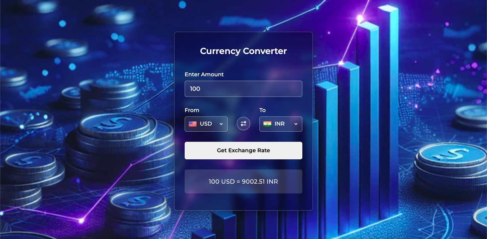
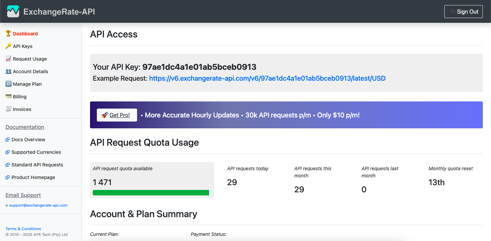

# 🌍 Currency Converter App

This currency converter app provides a clean and modern interface that makes converting money between different countries simple and intuitive. At the top, users can enter the amount they want to convert, followed by two dropdown menus—one for the source currency and one for the target currency. Each dropdown is enhanced with a country flag icon 🇺🇸🇮🇳, making it easier to quickly recognize currencies at a glance. The center also includes a swap/flip button 🔁, allowing users to instantly reverse the currency direction without manually changing both fields.

Once the currencies and amount are selected, users can tap the “Get Exchange Rate” button to fetch the latest conversion value. The result appears neatly below, showing the exact conversion in a clear and bold format—e.g., 100 USD = 9002.51 INR. The overall design combines a glassy card effect with a futuristic background, creating a stylish and user-friendly experience. The interface not only looks visually appealing but also ensures smooth usability for anyone who wants quick and accurate currency conversions.
---

## 📸 Screenshots

(Add your images in the `public/` folder and update the paths below)



---

## 🎥 Demo Video

(Add your thumbnail + YouTube/video link)

[](YOUR_VIDEO_LINK_HERE)

---

## ✨ Features

- Convert any amount between global currencies.
- Flag-based currency dropdowns for better identification.
- Swap/flip button to reverse currency direction instantly.
- Real-time conversion using Exchange Rate API.
- Glass-effect UI with futuristic design.
- Responsive layout for mobile and desktop.
- Fast performance with React + Vite.

---

## 🛠️ Tech Stack

- **React Vite**
- **CSS**

---

## 📁 Folder Structure


---


## 🚀 Getting Started

Follow the steps below to run this project locally.

### 1. Clone the repository

```bash
git clone https://github.com/your-username/currency-converter.git
```

### 2. Navigate into the project directory

```bash
cd currency-converter
```

### 3. Install dependencies

```bash
npm install
```

### 4. Get your Exchange Rate API key

#### 4(a) Go to the website
[](https://www.exchangerate-api.com/)

#### 4.2 Create a free account
Click "Get Free API Key"

#### 4.3 Copy your API key
After signup, the dashboard will show your key and their request that are hide in red boxes given below. You didnt need to copy the request URL. Noly need to copy the API key written in Hexademical format.



### 5. Create a .env file in your project root directory
Create a .env file and paste your Exchange Rate API Key here
```bash
VITE_EXCHANGE_RATE_API_KEY=your_api_key_here
```

### 6. Start development server

```bash
npm run dev
```

Your app will run at:

```bash
http://localhost:5173
```

### 7. If you want to build for production deployment 📦

```bash
npm run build
```
